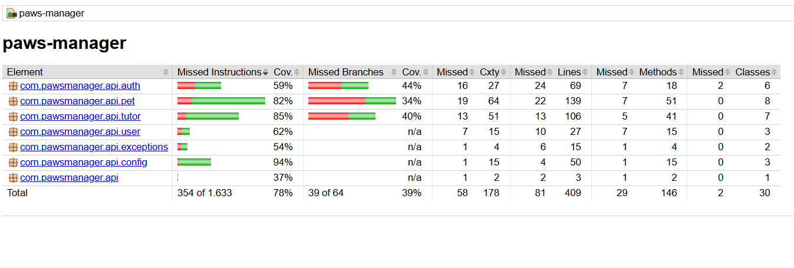
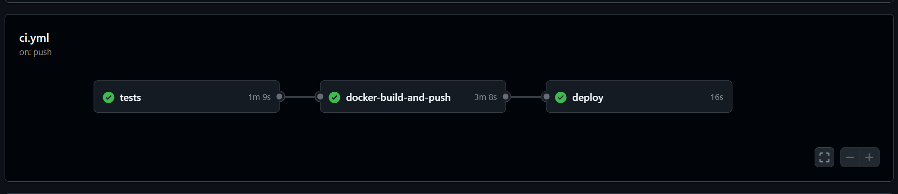

# 🐾 PawsManager

[](https://github.com/antonio-queiroz-dev/paws-manager/actions/workflows/ci.yml)

🔗 [Teste os endpoints em produção](https://pawsapi.antonioqueiroz.dev/swagger-ui/index.html) · Deploy na Oracle Cloud

API REST que percorre o ciclo completo de um backend, do primeiro endpoint até o deploy, com cache, CI/CD automatizado, testes de integração com Testcontainers e deploy automatizado em cloud.

CRUD de pets e tutores com busca por id, nome, sexo e tutor, com autenticação JWT.

## Decisões técnicas

**Redis:** Cache com TTL de 30 minutos para reduzir queries frequentes ao banco. Invalidação via @CacheEvict em atualizações e deleções para garantir consistência. Trade-off: risco de dados desatualizados se houver alterações fora da API.

**Package-by-feature:** Organização por feature onde cada pacote contém as classes de um domínio, facilitando a manutenção e adição de novos domínios.

**Flyway:** Introduzido antes do deploy para ter controle e versionamento dos schemas.

**Testcontainers:** Ambiente de testes igual ao de produção, evitando inconsistências. Trade-off: maior tempo de execução dos testes por conta dos containers a serem gerados.

## Testes

Testes unitários e de integração com cobertura de 78% geral, com 85% em tutor e 82% em pet, monitorada via JaCoCo no pipeline de CI.



## Stack

Java 21 · Spring Boot 3 · Spring Security · JWT · MySQL 8 · Redis · Docker · GitHub Actions · JaCoCo · Flyway · Testcontainers · Maven

## CI/CD

Pipeline com três jobs: testes, build da imagem Docker e deploy na Oracle Cloud.



## GHCR

Imagem disponível no GHCR:

```bash
docker pull ghcr.io/antonio-queiroz-dev/paws-manager:latest
```

## Autor

Desenvolvido por [Antonio Queiroz](https://linkedin.com/in/antonio-queiroz-dev) · [GitHub](https://github.com/antonio-queiroz-dev)