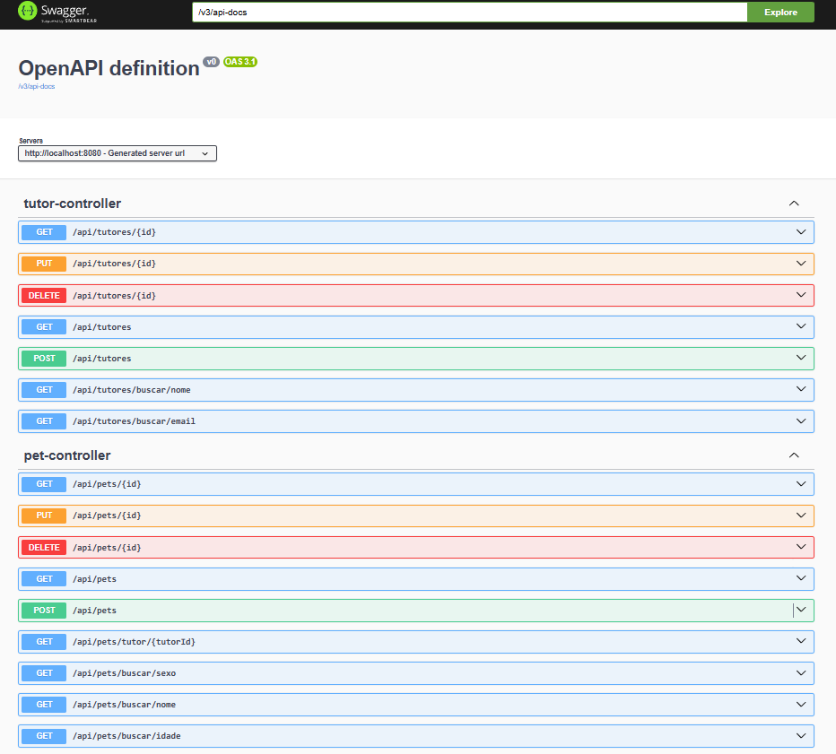
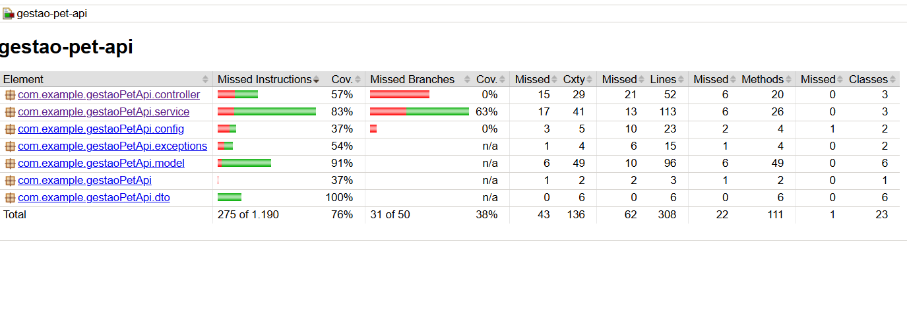

# 🐾 Paws manager

[](https://github.com/Antonio-scripts/gestao-pet-api/actions/workflows/ci.yml)

API REST desenvolvida com **Spring Boot 3**, **Java 21** e **MySQL** para o gerenciamento eficiente de pets e tutores.
O projeto adota práticas modernas de desenvolvimento, incluindo **Dockerização completa**, **Testes de Integração com
Testcontainers**, **Cache com Redis** e documentação via **Swagger UI**.

---------------------------------------

## 🚀 Tecnologias Utilizadas

* **Java 21** (LTS)
* **Spring Boot 3.5.6**
    * Spring Web
    * Spring Data JPA
    * Spring Data Redis
* **Banco de Dados**: MySQL 8
* **Cache**: Redis
* **Containerização**: Docker & Docker Compose
* **Testes**: JUnit 5 + Mockito (Unitários) · Testcontainers (Integração)
* **Documentação**: SpringDoc OpenAPI (Swagger UI)
* **Build**: Maven

---

## ⚙️ Pré-requisitos

* **Docker Desktop** (Obrigatório)
* **Git**

---

## ▶️ Como Executar (Via Docker)

A maneira mais simples de rodar a aplicação é utilizando o Docker Compose. Isso subirá o banco de dados, o cache Redis e
a API automaticamente.

1. **Clone o repositório:**
   ```bash
   git clone https://github.com/Antonio-scripts/paws-manager.git
   cd paws-manager
   ```

2. **Suba a aplicação:**
   ```bash
   docker compose up --build
   ```
   *Aguarde alguns instantes até que todos os containers estejam saudáveis (healthy).*

3. **Acesse a API:**
   A aplicação estará rodando em: `http://localhost:8080`

---

## 🐳 Docker & Containerização

A aplicação é totalmente containerizada. O `Dockerfile` utiliza **multi-stage build**: a primeira etapa compila o projeto com Maven e a segunda gera uma imagem final enxuta baseada apenas no JRE, reduzindo o tamanho da imagem em produção.

O `docker-compose.yml` orquestra três containers com **healthcheck** configurado, garantindo que a API só suba após MySQL e Redis estarem prontos:

| Container               | Imagem              | Porta  |
|-------------------------|---------------------|--------|
| `pawsmanager.api_mysql`    | mysql:8.0           | 3306   |
| `pawsmanager.api_redis`    | redis:latest        | 6379   |
| `pawsmanager.api_backend`  | build local         | 8080   |


---

## 💻 Desenvolvimento Local (Opcional)

Caso queira rodar a aplicação via IDE (IntelliJ/Eclipse) para desenvolvimento:

1. Suba apenas a infraestrutura (MySQL + Redis):
   ```bash
   docker compose up -d mysql redis
   ```
2. Configure sua IDE para usar o perfil `dev` (`-Dspring.profiles.active=dev`).
3. Execute a classe `pawsmanager.apiApplication`.

---

## 📚 Documentação da API (Swagger)

Com a aplicação rodando, acesse a documentação interativa para visualizar e testar todos os endpoints:

👉 **[http://localhost:8080/swagger-ui/index.html](http://localhost:8080/swagger-ui/index.html)**



---

## 🧠 Funcionalidades Principais

### 🐶 Pets

* **CRUD Completo**: Cadastro, listagem, atualização e remoção.
* **Buscas Avançadas**: Por nome, sexo, idade e tutor.
* **Validações de Negócio**:
    * Idade máxima de 20 anos.
    * Peso entre 0.5kg e 60kg.
    * Validação de nome

### 👤 Tutores

* **CRUD Completo**.
* **Validação Estrutural**: Uso de Bean Validation (`@NotBlank`, `@Email`).

---

## ⚡ Performance e Cache

O projeto utiliza **Redis** para cachear consultas frequentes (`@Cacheable`), reduzindo a carga no banco de dados. O
cache é invalidado automaticamente (`@CacheEvict`) quando dados são alterados, e possui um ttl de 30 minutos garantindo consistência.

---

## 🧪 Testes Automatizados

O projeto possui testes automatizados:

1. **Testes Unitários**: Validam a lógica de negócio isolada (Services) usando Mockito.
2. **Testes de Integração**: Usam **Testcontainers** para subir um banco MySQL real e descartável durante os testes,
   garantindo que a aplicação funcione de ponta a ponta.

Para rodar os testes (requer Java/Maven instalados):

```bash
mvn test
```

---

## 🏗️ Arquitetura

O projeto segue uma arquitetura limpa em camadas:

* **Controller**: Recebe as requisições HTTP, delega para o Service e retorna as respostas via DTOs.
* **Service**: Contém a lógica de negócio, aplica validações e gerencia o cache com Redis.
* **Repository**: Interface de acesso ao banco de dados via Spring Data JPA.
* **DTOs (Records)**: Objetos de transferência de dados que desacoplam a API do modelo interno.
* **Model**: Entidades JPA que representam as tabelas do banco de dados.

---

## 🚧 Roadmap

| Funcionalidades                      | status        |
|--------------------------------------|---------------|
| Criar testes unitarios               | **CONCLUÍDO** |
| Criar testes de integração           | **CONCLUÍDO** |
| Dockerizar completamente a aplicação | **CONCLUÍDO** |
| Implementar Cache com Redis          | **CONCLUÍDO** |
| Implementar CI/CD com GitHub Actions | **CONCLUÍDO** |
| Relatório de cobertura com JaCoCo    | **CONCLUÍDO** |
| Spring Security                      | *PENDENTE*    |
| Implementar novos dominios           | *PENDENTE*    |
| Implementar mensageria               | *PENDENTE*    |
| Publicar na nuvem                    | *PENDENTE*    |

---

## 📊 Cobertura de Testes (JaCoCo)

O projeto utiliza **JaCoCo** para gerar relatórios de cobertura de testes, integrado ao pipeline de CI.



---

## 🧑‍💻 Autor

Desenvolvido por **Antonio Queiroz**

💼 [LinkedIn](https://www.linkedin.com/in/antonio-queiroz-dev/) | 🐙 [GitHub](https://github.com/Antonio-queiroz-dev
)
